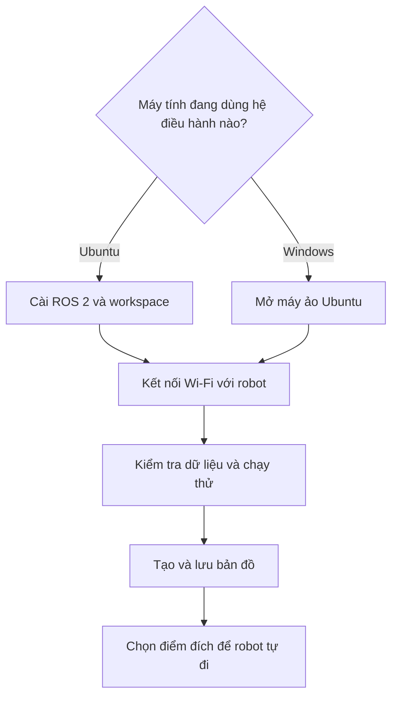

# Tổng quan Robot ESP32 LiDAR

Robot ESP32 LiDAR dùng để thực hành điều khiển robot, tạo bản đồ và tự di chuyển đến một điểm đã chọn.

Hệ thống gồm **robot** và **máy tính**, kết nối với nhau qua Wi-Fi.

## Robot và máy tính làm gì?

- **Robot:** đo khoảng cách bằng LiDAR, đọc chuyển động bánh xe bằng encoder và điều khiển động cơ.
- **Máy tính:** nhận dữ liệu từ robot, hiển thị lên màn hình, tạo bản đồ và tính đường đi.

ESP32 là bộ điều khiển gắn trên robot. Các phần mềm ROS 2, RViz, SLAM và Navigation2 chạy trên máy tính.

Bạn sẽ gặp bốn tên này trong các bài tiếp theo:

| Tên | Hiểu đơn giản |
| --- | --- |
| ROS 2 | Giúp các chương trình của robot trao đổi dữ liệu và lệnh |
| RViz | Cửa sổ để xem robot, dữ liệu LiDAR và bản đồ |
| SLAM | Tạo bản đồ khi bạn cho robot di chuyển quanh khu vực |
| Navigation2, còn gọi là Nav2 | Dùng bản đồ để đưa robot tới điểm bạn chọn |

Xem [Kiến trúc hệ thống](02-kien-truc-he-thong.md) để biết các thành phần nối với nhau như thế nào.

## Bắt đầu theo thứ tự nào?

**Workspace** là thư mục chứa phần mềm của robot trên máy tính.

| Bạn đang ở bước nào? | Mở bài này |
| --- | --- |
| Chuẩn bị máy tính Ubuntu | [Cài ROS 2](../02-chuan-bi/01-yeu-cau-va-cai-ros2.md), sau đó [cài workspace](../02-chuan-bi/02-cai-dat-workspace.md) |
| Chuẩn bị máy tính Windows | [Sử dụng máy ảo Ubuntu](../02-chuan-bi/04-windows-may-ao-ubuntu.md) |
| Kết nối robot | [Wi-Fi mặc định](../02-chuan-bi/03-cau-hinh-wifi.md) hoặc [Wi-Fi ngoài](../02-chuan-bi/05-su-dung-wifi-ngoai.md) |
| Kiểm tra trước khi chạy | [Khởi động và kiểm tra dữ liệu](../03-van-hanh/02-khoi-dong-va-kiem-tra.md) |
| Thử điều khiển robot | [Chạy thử lần đầu](../03-van-hanh/01-chay-thu-lan-dau.md) |
| Tạo bản đồ | [Tạo bản đồ SLAM](../05-lidar-slam-navigation/02-tao-ban-do-slam.md), sau đó [lưu bản đồ](../05-lidar-slam-navigation/03-luu-va-quan-ly-ban-do.md) |
| Cho robot tự đi tới đích | [Điều hướng bằng Nav2](../05-lidar-slam-navigation/04-dieu-huong-nav2.md) |

Trước khi chạy robot, đọc [An toàn và giới hạn](04-an-toan-va-gioi-han.md). Thông tin phần cứng và phần mềm nằm trong bài [Tính năng và thông số](05-tinh-nang-va-thong-so.md).
