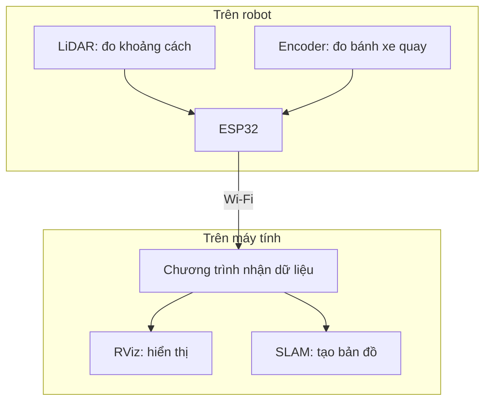
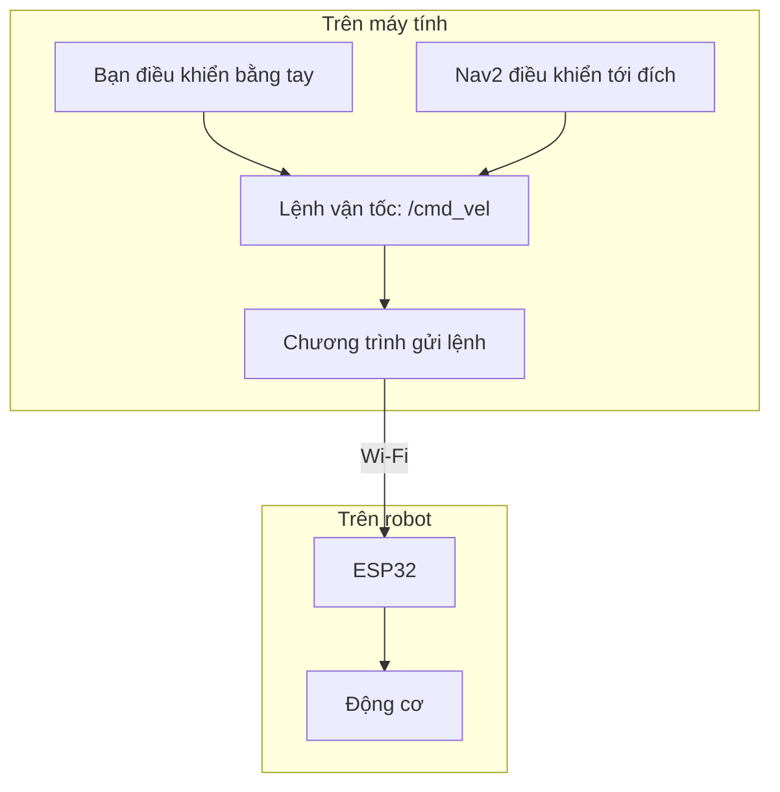

# Kiến trúc hệ thống

Robot và máy tính trao đổi hai thứ qua Wi-Fi:

- Robot gửi **dữ liệu cảm biến** lên máy tính.
- Máy tính gửi **lệnh chuyển động** xuống robot.

## 1. Dữ liệu từ robot lên máy tính

ESP32 đọc cảm biến và gửi dữ liệu về máy tính. Chương trình kết nối trên máy tính đưa dữ liệu vào ROS 2. Từ đó, RViz có thể hiển thị và SLAM có thể tạo bản đồ.

Trong hướng dẫn, bạn sẽ chạy một lệnh **bringup** để mở chương trình kết nối này. Có thể hiểu bringup là bước **khởi động phần mềm để máy tính làm việc với robot**.

## 2. Lệnh từ máy tính xuống robot

Có hai cách điều khiển:

- **Điều khiển tay:** bạn chọn tốc độ tiến, lùi hoặc quay.
- **Điều hướng bằng Nav2:** bạn chọn điểm đích; máy tính tự tính đường và liên tục gửi lệnh vận tốc cho robot.

Mỗi lúc chỉ dùng một cách điều khiển. Khi Nav2 đang chạy, không gửi thêm lệnh từ công cụ điều khiển tay.

## 3. Ba tên cần nhớ

ROS 2 dùng các kênh gọi là **topic** để truyền dữ liệu. Trong các bài thực hành, bạn chủ yếu gặp:

| Topic | Chứa gì? |
| --- | --- |
| `/scan` | Khoảng cách do LiDAR đo được |
| `/odom` | Ước lượng robot đã đi và quay như thế nào |
| `/cmd_vel` | Lệnh cho robot tiến, lùi hoặc quay |

Các topic này được sử dụng trong ROS 2 trên máy tính. Chương trình kết nối đảm nhiệm việc trao đổi dữ liệu và lệnh với ESP32.

**Ví dụ:** khi bạn chọn “tiến”, máy tính gửi lệnh qua `/cmd_vel`. ESP32 nhận lệnh và cho bánh xe quay. Encoder đo chuyển động bánh xe; thông tin chuyển động được gửi lại máy tính và thể hiện trên `/odom`.

Chi tiết các trường dữ liệu nằm trong bài [Các topic của robot](../04-ros2-co-ban/02-cac-topic-cua-robot.md).

**Bước thực hành tiếp theo:** [Khởi động và kiểm tra dữ liệu](../03-van-hanh/02-khoi-dong-va-kiem-tra.md).
