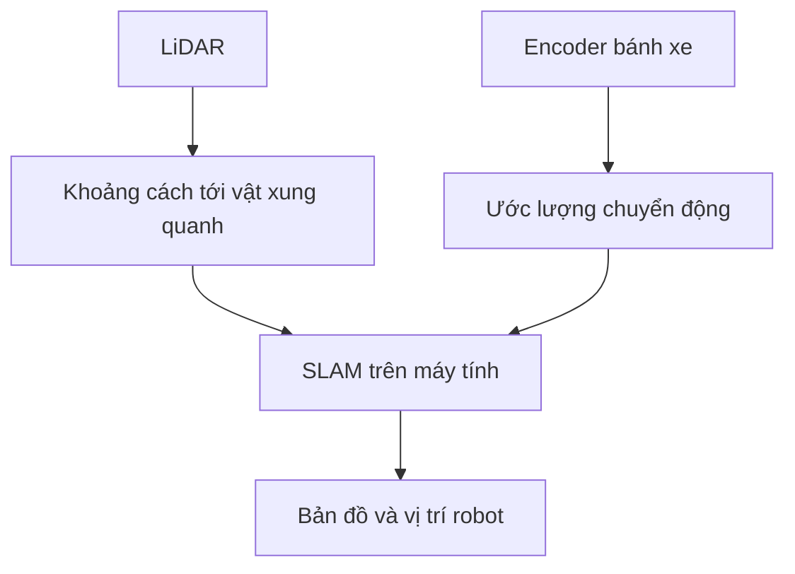

# LiDAR và odometry

Để tạo bản đồ, máy tính cần biết hai điều:

1. **Xung quanh robot có gì?** Dữ liệu LiDAR giúp trả lời.
2. **Robot vừa di chuyển ra sao?** Odometry giúp trả lời.

## 1. LiDAR đo khoảng cách

LiDAR quét xung quanh và đo khoảng cách tới tường, bàn, ghế hoặc vật cản. Dữ liệu được xem qua topic `/scan`.

**Ví dụ:** robot đang cách tường khoảng 1 m. Các tia quét hướng về tường sẽ đo được khoảng cách tương ứng. Khi robot tiến gần tường, khoảng cách này giảm.

LiDAR trên robot là loại **2D**: nó đo trong một mặt phẳng, ở độ cao lắp cảm biến. Một vật quá thấp hoặc quá cao có thể nằm ngoài mặt phẳng quét.

## 2. Encoder và odometry cho biết chuyển động

**Encoder** đo bánh xe đã quay bao nhiêu. Từ đó, hệ thống ước lượng robot đã đi được bao xa và đã quay bao nhiêu. Kết quả ước lượng này gọi là **odometry**, được xem qua topic `/odom`.

**Ví dụ:** khi robot tiến, vị trí trong `/odom` thay đổi. Khi robot quay tại chỗ, hướng trong `/odom` thay đổi.

Odometry có thể bị sai nếu bánh xe trượt. Bánh xe vẫn quay nhưng robot không đi được đúng quãng đường mà hệ thống ước lượng.

## 3. Hai loại dữ liệu phối hợp thế nào?

Khi bạn cho robot đi quanh phòng, máy tính ghép nhiều lần quét LiDAR với chuyển động của robot để tạo bản đồ.

**Một lần quét LiDAR** chỉ cho biết những gì cảm biến đang nhìn thấy. **Bản đồ** được tạo từ nhiều lần quét khi robot đi qua các vị trí khác nhau.

## 4. Quan sát gì khi chạy thử?

| Trạng thái robot | Kết quả nên thấy |
| --- | --- |
| Đứng yên | LiDAR vẫn cập nhật; vị trí odometry gần như giữ nguyên |
| Tiến hoặc lùi | Vị trí odometry thay đổi |
| Quay tại chỗ | Hướng odometry thay đổi |
| Bánh xe trượt | Odometry có thể khác với chuyển động thật |

Nếu bản đồ bị méo, cần kiểm tra dữ liệu và chuyển động của robot trước khi chỉnh phần mềm SLAM.

**Bài thực hành:** [Kiểm tra dữ liệu LiDAR](../05-lidar-slam-navigation/01-kiem-tra-lidar.md) và [Chạy thử lần đầu](../03-van-hanh/01-chay-thu-lan-dau.md).
