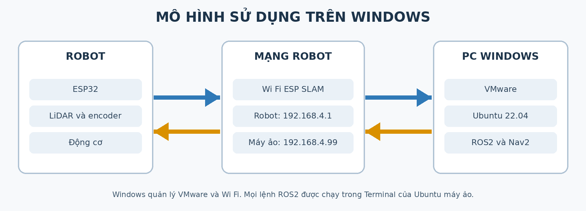

# Cài đặt trên Windows với máy ảo Ubuntu

!!! tip "Dành cho người mới"
    Nếu chưa quen Ubuntu, xem [series Ubuntu cơ bản](../../ubuntu-co-ban/index.md). Riêng thao tác nhập và dừng lệnh có trong bài [Làm quen với Terminal](../../ubuntu-co-ban/04-terminal.md).

Luồng này dành cho **Windows 10/11 64 bit**. Windows quản lý Wi-Fi và VMware; các lệnh ROS 2, SLAM và Nav2 chạy **trong Terminal Ubuntu 22.04 của máy ảo**, không chạy trong PowerShell hoặc Command Prompt.



## Chuẩn bị

| Hạng mục | Nội dung từ bộ bàn giao |
| --- | --- |
| Bộ cài máy ảo | VMware Workstation 17 do ROBOVIS cung cấp hoặc bản tương thích được đơn vị hỗ trợ |
| Máy ảo | Tệp `robovis.zip` chứa Ubuntu 22.04 và môi trường robot đã chuẩn bị |
| RAM và đĩa trống | Tối thiểu 8 GB RAM, 30 GB trống; 16 GB RAM và 50 GB trống sẽ thoải mái hơn |
| Wi-Fi robot | `ESP SLAM` hoặc `ESP32_SLAM`, mật khẩu `12345678` |

Tải đủ bộ cài và máy ảo **khi Windows còn Internet**. Wi-Fi robot thường không có Internet.

## 1. Cài VMware và mở máy ảo

1. Nếu VMware Workstation đã cài và hoạt động, chuyển sang bước 2. Nếu chưa, chạy tệp cài đặt trong bộ bàn giao và hoàn thành trình cài đặt theo màn hình. Tài liệu gốc minh họa bản 17.6.1.
2. Giải nén toàn bộ `robovis.zip` vào ổ đĩa đủ dung lượng. Trong VMware chọn **Open a Virtual Machine**, mở tệp `.vmx` trong thư mục vừa giải nén.
3. Trước khi bật máy ảo, kiểm tra **Network Adapter** được đặt ở **Bridged** và nối với card Wi-Fi Windows đang dùng. Đây là cấu hình minh họa trong tài liệu bàn giao. Nếu có nhiều card mạng, kiểm tra VMware đang bridge đúng card Wi-Fi.
4. Chọn **Power on this virtual machine**. Nếu VMware hỏi máy ảo đã di chuyển hay sao chép, chọn **I copied it**. Đăng nhập Ubuntu theo thông tin bàn giao; tài liệu kèm theo ghi mật khẩu máy ảo mặc định là `1`.

Máy ảo đã có ROS 2 và gói robot theo bộ bàn giao, vì vậy không thực hiện lại phần cài ROS 2 trên Ubuntu trực tiếp.

## 2. Kết nối Windows với Wi-Fi robot

1. Đặt robot trên sàn phẳng, bật nguồn và chờ mạng do robot phát.
2. Trên **Windows**, kết nối `ESP SLAM` hoặc `ESP32_SLAM`; nhập mật khẩu `12345678`.
3. Giữ kết nối dù Windows báo không có Internet.

## 3. Kiểm tra kết nối trong Ubuntu máy ảo

Mở Terminal trong Ubuntu bằng `Ctrl+Alt+T`:

```bash
ip -4 addr
ping -c 4 192.168.4.1
```

Robot có địa chỉ `192.168.4.1`; địa chỉ Ubuntu máy ảo trong cấu hình bàn giao là `192.168.4.99`. Chỉ tiếp tục khi máy ảo thấy đúng địa chỉ và ping được robot. Nếu Windows đã vào Wi-Fi robot nhưng Ubuntu chưa ping được, kiểm tra lại chế độ **Bridged**, card Wi-Fi được bridge và địa chỉ trong Ubuntu.

## 4. Khởi động và chạy thử

Giữ mỗi lệnh chạy liên tục trong một Terminal riêng **bên trong Ubuntu**. Terminal 1:

```bash
ros2 launch robot_bringup robot_bringup.launch.py
```

Terminal 2, kiểm tra dữ liệu và thử điều khiển khi khu vực xung quanh an toàn:

```bash
ros2 topic list
ros2 topic hz /scan
```

Nhấn `Ctrl+C` để dừng lệnh đo tần số trước khi chạy lệnh tiếp theo. Theo [hướng dẫn điều khiển tay](../03-van-hanh/03-dieu-khien-bang-tay.md) để thử chuyển động ở tốc độ thấp.

## 5. Làm việc với bản đồ

- [Tạo bản đồ SLAM](../05-lidar-slam-navigation/02-tao-ban-do-slam.md): giữ bringup đang chạy, mở Terminal khác cho SLAM và cửa sổ điều khiển.
- [Lưu bản đồ](../05-lidar-slam-navigation/03-luu-va-quan-ly-ban-do.md): lưu `m_map.yaml` và `m_map.pgm` trong Home của **Ubuntu máy ảo**.
- [Điều hướng Nav2](../05-lidar-slam-navigation/04-dieu-huong-nav2.md): dừng SLAM trước, giữ bringup rồi khởi chạy Navigation với tệp bản đồ đã lưu.

Các đường dẫn `~/m_map.yaml` trong các trang sau đều chỉ **Home của Ubuntu máy ảo**, không phải thư mục Windows.
