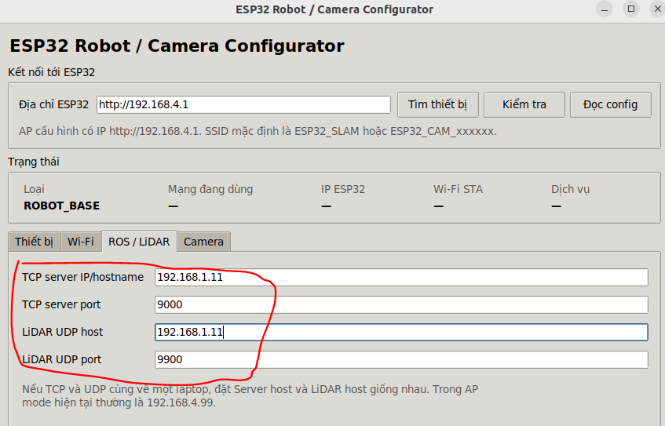

# Sử dụng Wi-Fi ngoài

Mặc định robot phát mạng `ESP32_SLAM` (một số firmware hiện `ESP SLAM`). Trang này chỉ dành cho trường hợp bạn muốn robot tham gia mạng Wi-Fi 2,4 GHz của phòng học hoặc phòng lab. Nếu tiếp tục dùng mạng robot mặc định, [kết nối theo hướng dẫn này](03-cau-hinh-wifi.md) và bỏ qua toàn bộ thao tác bên dưới.

**Điều kiện:** máy tính chạy ROS 2 và ESP32 robot phải ở cùng mạng. Trên Windows, máy ảo Ubuntu vẫn cần giao tiếp với robot qua card mạng được bridge. ESP32-CAM là thiết bị tùy chọn; nếu robot không có camera, bỏ qua phần camera.

## 1. Ghi IP của máy tính trên Wi-Fi mới

Kết nối máy tính với Wi-Fi muốn sử dụng rồi mở Terminal Ubuntu:

```bash
hostname -I
```

Ghi IP tương ứng với mạng Wi-Fi mới. Ví dụ trong trang này: SSID `ROBOT_WIFI`, IP máy tính `192.168.1.11`. **Đây chỉ là ví dụ**; nhập IP thực tế của bạn. Trên Windows, kiểm tra IP mà **Ubuntu máy ảo** dùng để chạy ROS 2.

## 2. Mở công cụ cấu hình của robot

1. Chuyển máy tính sang Wi-Fi do robot phát, mật khẩu `12345678`.
2. Đặt `esp32_robot_configurator.py` do ROBOVIS cung cấp vào Home của Ubuntu, rồi chạy:

   ```bash
   python3 ~/esp32_robot_configurator.py
   ```

3. Nếu báo thiếu Tkinter, khi còn kết nối Internet cài `python3-tk`, rồi mở lại chương trình.
4. Chọn **Tìm thiết bị**, chọn loại `ROBOT_BASE`, sau đó chọn **Chọn và đọc config**. Nếu không tìm thấy, nhập `http://192.168.4.1` vào ô địa chỉ ESP32 và thử **Đọc config**.

## 3. Nhập mạng và nơi nhận dữ liệu

Trong tab **Wi-Fi**, chọn chế độ `AUTO`, nhập SSID và mật khẩu của mạng mới. Trong tab **ROS / LiDAR**, nhập IP máy tính đã ghi ở bước 1:

| Trường trong công cụ | Giá trị ví dụ |
| --- | --- |
| TCP server IP/hostname | `192.168.1.11` |
| TCP server port | `9000` |
| LiDAR UDP host | `192.168.1.11` |
| LiDAR UDP port | `9900` |



Nếu hai dịch vụ chạy trên cùng một PC, hai ô địa chỉ phải trỏ đến cùng IP của PC đó. Giữ nguyên cổng `9000` và `9900` theo cấu hình được bàn giao. Chọn **Lưu config và khởi động lại**, xác nhận và chờ khoảng 15 giây. Mạng riêng của robot có thể biến mất trong lúc chuyển sang Wi-Fi mới.

## 4. Kiểm tra robot đã vào mạng mới

Kết nối lại máy tính với Wi-Fi mới; trong công cụ cấu hình chọn **Tìm thiết bị**. Khi thấy `ROBOT_BASE`, chọn thiết bị và đọc cấu hình. Sau đó chạy bringup và kiểm tra `/scan`, `/odom` như [hướng dẫn khởi động](../03-van-hanh/02-khoi-dong-va-kiem-tra.md). Nếu công cụ không tìm thấy robot, kiểm tra SSID, mật khẩu và xem robot có trở về mạng `ESP32_SLAM` hay không.

## Nếu phiên bản có ESP32-CAM

Camera là phần tùy chọn. Nếu có, hãy cấp nguồn và kết nối máy tính tới mạng cấu hình `ESP32_CAM_...` của camera (mật khẩu mặc định `12345678`), mở công cụ rồi chọn loại `CAMERA`. Trong tab **Wi-Fi**, nhập cùng SSID với robot. Trong tab **Camera**, thay `IP_MAY_TINH` bằng IP ở bước 1 tại **HTTP upload URL**:

```text
http://IP_MAY_TINH:5000/upload
```

Lưu và khởi động lại; kết nối máy tính trở về Wi-Fi mới, tìm lại `ROBOT_BASE` và `CAMERA`. Nếu camera đã ở một Wi-Fi khác và không phát mạng cấu hình, kết nối máy tính vào mạng đó để tìm camera theo công cụ bàn giao.

## Khi IP máy tính thay đổi

Robot có thể kết nối Wi-Fi thành công nhưng không gửi được dữ liệu về ROS 2 nếu IP máy tính thay đổi. Cách ổn định là cấu hình bộ phát Wi-Fi luôn cấp cùng IP cho máy tính. Nếu dùng IP động, chạy lại `hostname -I`, cập nhật **cả hai ô IP** trong tab **ROS / LiDAR**; với phiên bản có camera, cập nhật IP trong URL `:5000/upload` của camera. Giữ nguyên các cổng đã bàn giao.

Nếu chỉ đổi IP, công cụ cấu hình không hiển thị lại mật khẩu Wi-Fi đã lưu; theo hướng dẫn bàn giao, để trống ô mật khẩu khi bạn muốn giữ mật khẩu cũ.
