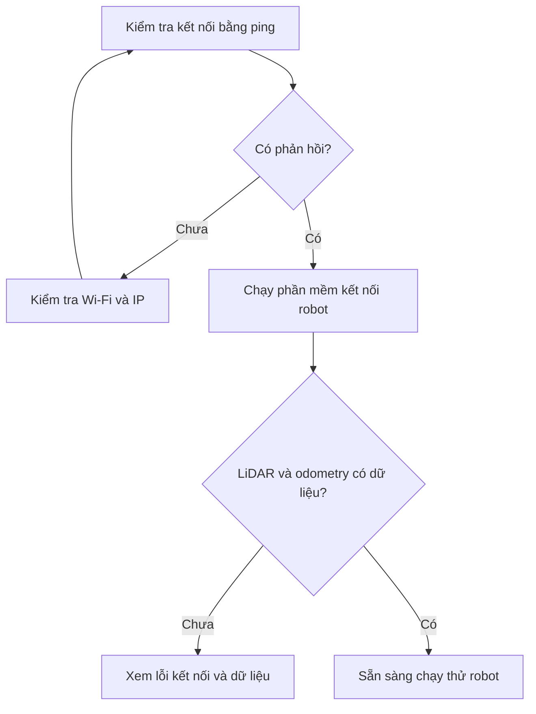

# Khởi động và kiểm tra dữ liệu

**Mục tiêu:** máy tính nhận được dữ liệu LiDAR và chuyển động của robot.

Trước khi làm, cần hoàn tất [cài workspace trên Ubuntu](../02-chuan-bi/02-cai-dat-workspace.md) hoặc [chuẩn bị máy ảo trên Windows](../02-chuan-bi/04-windows-may-ao-ubuntu.md). Chạy các lệnh dưới đây trong **Terminal của Ubuntu**.

## Trình tự kiểm tra



## Bước 1. Kiểm tra Wi-Fi

Bật robot và kết nối Ubuntu với cùng mạng Wi-Fi của robot.

Nếu dùng **Wi-Fi mặc định do robot phát**, chạy:

```bash
ping -c 4 192.168.4.1
```

**Kết quả cần thấy:** có các dòng phản hồi chứa `bytes from 192.168.4.1`.

Nếu dùng **Wi-Fi ngoài**, thay `192.168.4.1` bằng IP hiện tại của robot. Xem cách tìm IP trong bài [Sử dụng Wi-Fi ngoài](../02-chuan-bi/05-su-dung-wifi-ngoai.md).

Nếu chưa có phản hồi, kiểm tra lại [cấu hình Wi-Fi](../02-chuan-bi/03-cau-hinh-wifi.md) trước khi sang bước 2.

## Bước 2. Mở phần mềm kết nối robot

Trong **Terminal 1**, chạy:

```bash
ros2 launch robot_bringup robot_bringup.launch.py
```

Lệnh này mở các chương trình kết nối máy tính với robot. Bước này được gọi là **bringup**.

**Giữ Terminal 1 mở.** Chỉ chạy lệnh bringup một lần.

Nếu báo không tìm thấy `robot_bringup`, kiểm tra phần nạp môi trường trong bài [cài workspace](../02-chuan-bi/02-cai-dat-workspace.md).

## Bước 3. Tìm các kênh dữ liệu

Mở **Terminal 2**, chạy:

```bash
ros2 topic list
```

**Kết quả cần tìm:**

| Tên | Ý nghĩa |
| --- | --- |
| `/scan` | Dữ liệu LiDAR |
| `/odom` | Ước lượng chuyển động |
| `/cmd_vel` | Lệnh vận tốc |

Các kênh này gọi là **topic**. Nếu tên thực tế có thêm phần đầu, ví dụ `/robot_1/scan`, hãy dùng nguyên tên đó trong các lệnh tiếp theo.

## Bước 4. Kiểm tra LiDAR có gửi dữ liệu

Trong Terminal 2, chạy:

```bash
ros2 topic hz /scan
```

**Kết quả cần thấy:** lệnh liên tục in các dòng có `average rate`. Con số đi kèm là số lần nhận dữ liệu trong một giây.

Nhấn **Ctrl+C** trong Terminal 2 để dừng lệnh kiểm tra. Terminal 1 vẫn giữ nguyên.

## Bước 5. Kiểm tra odometry

Trong Terminal 2, chạy:

```bash
ros2 topic hz /odom
```

**Kết quả cần thấy:** tiếp tục xuất hiện các dòng `average rate`.

Robot đang đứng yên vẫn có thể gửi dữ liệu odometry. Lúc này, tọa độ trong dữ liệu gần như không đổi.

Nhấn **Ctrl+C** để dừng lệnh kiểm tra.

## Hoàn thành

Nếu cả `/scan` và `/odom` đều cập nhật, giữ Terminal 1 mở và chuyển sang [Chạy thử lần đầu](01-chay-thu-lan-dau.md).

Nếu có tên topic nhưng không có dữ liệu, xem [Lỗi kết nối và ROS 2](../06-xu-ly-su-co/01-loi-ket-noi-va-ros2.md). Nếu chỉ LiDAR gặp vấn đề, xem [Kiểm tra dữ liệu LiDAR](../05-lidar-slam-navigation/01-kiem-tra-lidar.md).

Nếu muốn kết thúc buổi thực hành, nhấn **Ctrl+C** trong Terminal 1, chờ chương trình dừng rồi tắt robot.
