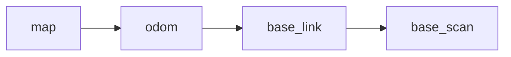

# RViz và hệ tọa độ TF

## RViz dùng để làm gì?

RViz là công cụ hiển thị dữ liệu ROS 2. Với Robot ESP32 LiDAR, RViz có thể hiển thị:

- Mô hình robot.
- Dữ liệu LaserScan.
- Odometry.
- Bản đồ 2D.
- Đường đi và vùng vật cản của Nav2.
- Quan hệ giữa các hệ tọa độ TF.

RViz chỉ là công cụ hiển thị và tương tác; đóng RViz không đồng nghĩa toàn bộ node nền đã dừng.

## Fixed Frame

`Fixed Frame` là hệ tọa độ tham chiếu chính của RViz.

| Chế độ | Fixed Frame thường dùng |
| --- | --- |
| Kiểm tra robot và odometry | `odom` |
| Tạo bản đồ SLAM | `map` |
| Navigation2 | `map` |

Nếu RViz báo `No transform` hoặc dữ liệu nhảy bất thường, kiểm tra Fixed Frame và chuỗi TF.

## Các frame thường gặp



- `map`: hệ tọa độ bản đồ.
- `odom`: hệ tọa độ odometry cục bộ.
- `base_link`: thân robot.
- `base_scan`: vị trí LiDAR trên robot.

Tên frame thực tế phụ thuộc workspace được cung cấp.

## Kiểm tra TF

```bash
ros2 topic echo /tf --once
ros2 topic echo /tf_static --once
```

Hoặc trong RViz:

1. Chọn **Add**.
2. Thêm display **TF**.
3. Quan sát các frame và quan hệ giữa chúng.

## Thêm LaserScan trong RViz

1. Chọn **Add**.
2. Chọn **LaserScan**.
3. Chọn đúng topic `/scan`.
4. Chọn Fixed Frame phù hợp.
5. Quan sát điểm quét có khớp tường và vật thật hay không.

Nếu LaserScan có dữ liệu nhưng RViz không hiển thị, thường cần kiểm tra `Fixed Frame`, `header.frame_id` hoặc TF từ thân robot tới LiDAR.
