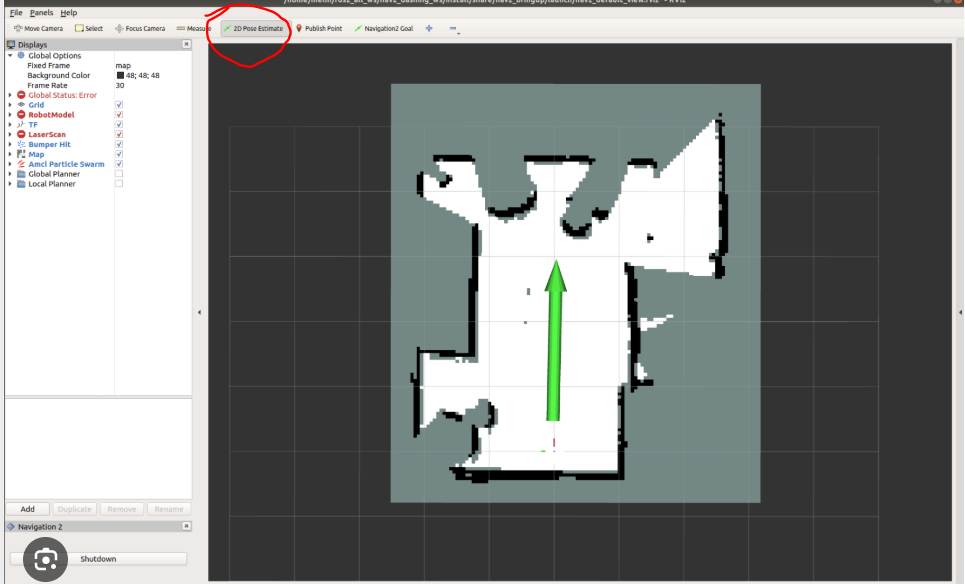

# Tạo bản đồ SLAM

## Điều kiện trước khi chạy

- Ping robot thành công.
- Bringup đang chạy ổn định.
- `/scan` và `/odom` cập nhật liên tục.
- Robot đi đúng hướng khi điều khiển bằng tay.
- Khu vực thử an toàn và đủ đặc trưng để LiDAR nhận biết.

## 1. Chuẩn bị các Terminal

| Terminal | Tiến trình |
| --- | --- |
| 1 | Bringup |
| 2 | `rqt_robot_steering` |
| 3 | SLAM và RViz |

Terminal 1:

```bash
ros2 launch robot_bringup robot_bringup.launch.py
```

Terminal 2:

```bash
ros2 run rqt_robot_steering rqt_robot_steering
```

Terminal 3:

```bash
ros2 launch robot_bringup robot_slam.launch.py
```

Sau vài giây, RViz phải hiển thị dữ liệu LiDAR và vùng bản đồ đang được tạo.

## 2. Cách di chuyển khi tạo bản đồ

1. Bắt đầu tại vị trí có tường, góc hoặc vật cố định rõ ràng.
2. Đi chậm dọc theo mép ngoài của khu vực.
3. Quay từ từ tại các góc.
4. Đi qua các lối bên trong sau khi đã có đường bao cơ bản.
5. Quay lại một số vị trí cũ để thuật toán nhận ra vòng kín.
6. Theo dõi RViz trong suốt quá trình.

## Nên làm

- Giữ vận tốc tuyến tính thấp và ổn định.
- Cho LiDAR nhìn thấy nhiều đặc trưng cố định.
- Đi lại qua khu vực đã quét từ hướng khác.
- Dừng và tạo lại nếu bản đồ đã sai nghiêm trọng.

## Không nên làm

- Quay gấp hoặc đổi hướng liên tục.
- Để bánh xe trượt.
- Nhấc hoặc kéo robot bằng tay.
- Di chuyển bàn ghế lớn trong khi đang quét.
- Tiếp tục mở rộng một bản đồ đã nhân đôi tường rõ rệt.

## Dấu hiệu bản đồ đang tốt

- Tường hiện thành đường tương đối liền.
- Các góc phòng đúng hình dạng thực tế.
- Khi quay lại điểm cũ, hai phần bản đồ khớp nhau.
- Biểu tượng robot không nhảy xa đột ngột.



*Ảnh RViz minh họa từ tài liệu bàn giao; giao diện có thể khác tùy workspace.*
