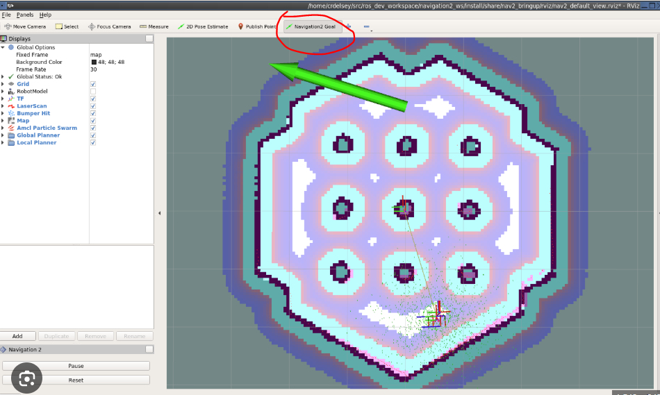

# Điều hướng tự động bằng Nav2

## Điều kiện trước khi chạy

- Có bản đồ hợp lệ gồm file `.yaml` và `.pgm`.
- Bringup đang chạy.
- `/scan` và `/odom` có dữ liệu.
- Terminal SLAM đã được dừng.
- Robot đang đứng yên và khu vực thử an toàn.

## 1. Khởi chạy Navigation2

Với bản đồ `~/m_map.yaml`:

```bash
ros2 launch robot_navigation navigation2.launch.py map:=$HOME/m_map.yaml
```

Nếu bản đồ có tên hoặc vị trí khác, thay bằng đường dẫn tương ứng:

```bash
ros2 launch robot_navigation navigation2.launch.py map:=$HOME/robot_maps/phong_lab.yaml
```

Sau khi khởi động, RViz phải hiển thị bản đồ.

## 2. Đặt vị trí ban đầu

Robot cần biết vị trí và hướng hiện tại trên bản đồ.

1. Đặt robot thật tại một vị trí dễ nhận biết.
2. Trong RViz, chọn **2D Pose Estimate**.
3. Nhấn giữ chuột tại vị trí tương ứng trên bản đồ.
4. Kéo mũi tên theo đúng hướng đầu robot ngoài thực tế.
5. Thả chuột và chờ dữ liệu định vị hội tụ.
6. So sánh điểm LiDAR với tường trên bản đồ.

Nếu điểm quét không chồng khớp với tường, hãy đặt lại vị trí và hướng. Không gửi mục tiêu khi vị trí ban đầu còn sai.

## 3. Gửi mục tiêu

1. Chọn **Nav2 Goal** hoặc **2D Nav Goal**.
2. Nhấn giữ tại vị trí đích.
3. Kéo mũi tên theo hướng robot cần quay mặt khi đến đích.
4. Thả chuột để gửi mục tiêu.
5. Quan sát đường đi dự kiến và robot thật.

## 4. Giám sát chuyển động

- Không gửi lệnh từ `rqt_robot_steering` khi Nav2 đang điều khiển.
- Theo dõi cả robot thật và RViz.
- Hủy mục tiêu nếu robot đi sai, rung hoặc đến quá gần vật cản.
- Lần thử đầu nên chọn đích gần, nằm trong vùng trống rộng.
- Không thử cạnh bậc thang hoặc khu vực không có rào bảo vệ.

## 5. Dừng hệ thống

1. Hủy mục tiêu hiện tại.
2. Chờ robot dừng hoàn toàn.
3. Nhấn `Ctrl+C` trong Terminal Navigation.
4. Nhấn `Ctrl+C` trong Terminal bringup.
5. Tắt nguồn robot.



*Ảnh minh họa RViz từ tài liệu bàn giao; luôn theo dõi robot thật khi thử Nav2.*
