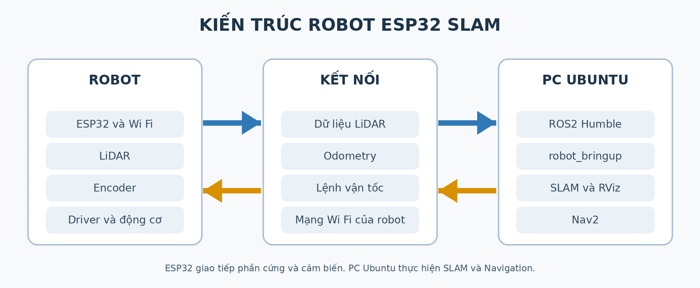

# Robot ESP32 LiDAR

Robot ESP32 LiDAR là nền tảng thực hành với robot di động thật, LiDAR 2D và encoder bánh xe. Người dùng điều khiển robot, xem dữ liệu trên ROS 2, tạo bản đồ SLAM và thử điều hướng Nav2.

**Cách hệ thống vận hành:** ESP32 trên robot đọc cảm biến và điều khiển động cơ. PC hoặc laptop chạy Ubuntu 22.04 và ROS 2 Humble nhận dữ liệu qua Wi-Fi, xử lý SLAM và Navigation2. Robot cần kết nối với máy tính trong các bài thực hành này.

!!! tip "Chưa từng dùng Ubuntu?"
    Hãy bắt đầu với [Ubuntu cơ bản](../ubuntu-co-ban/index.md). Bạn sẽ học cách mở Terminal, chạy lệnh, tìm thư mục và kiểm tra mạng trước khi vận hành robot.

## Bắt đầu theo hệ điều hành

| Máy tính của bạn | Hướng dẫn đầu tiên | Môi trường chạy lệnh ROS 2 |
| --- | --- | --- |
| Đã cài Ubuntu 22.04 | [Cài đặt trên Ubuntu](02-chuan-bi/01-yeu-cau-va-cai-ros2.md) | Terminal Ubuntu trên máy tính |
| Chạy Windows 10 hoặc 11 | [Cài đặt trên Windows với máy ảo Ubuntu](02-chuan-bi/04-windows-may-ao-ubuntu.md) | Terminal Ubuntu trong VMware |

Sau khi chuẩn bị máy tính, hãy đọc [kết nối Wi-Fi của robot](02-chuan-bi/03-cau-hinh-wifi.md), [khởi động và kiểm tra dữ liệu](03-van-hanh/02-khoi-dong-va-kiem-tra.md), rồi [chạy thử lần đầu](03-van-hanh/01-chay-thu-lan-dau.md).

## Tìm đúng nội dung

| Mục tiêu | Trang hướng dẫn |
| --- | --- |
| Xem khả năng, thành phần và giới hạn | [Tính năng và thông số](01-gioi-thieu/05-tinh-nang-va-thong-so.md) |
| Hiểu robot trao đổi dữ liệu với ROS 2 thế nào | [Kiến trúc hệ thống](01-gioi-thieu/02-kien-truc-he-thong.md) |
| Kiểm tra LiDAR và encoder | [Kiểm tra LiDAR](05-lidar-slam-navigation/01-kiem-tra-lidar.md), [các topic của robot](04-ros2-co-ban/02-cac-topic-cua-robot.md) |
| Tạo bản đồ mới | [Tạo bản đồ SLAM](05-lidar-slam-navigation/02-tao-ban-do-slam.md) |
| Dùng lại bản đồ để đi tới điểm đích | [Điều hướng bằng Nav2](05-lidar-slam-navigation/04-dieu-huong-nav2.md) |
| Chuyển sang Wi-Fi của phòng học hoặc phòng lab | [Sử dụng Wi-Fi ngoài](02-chuan-bi/05-su-dung-wifi-ngoai.md) |

Trước khi vận hành, đọc [an toàn và giới hạn](01-gioi-thieu/04-an-toan-va-gioi-han.md). Nếu robot mất kết nối, kiểm tra **nguồn → Wi-Fi → IP → bringup → topic** trước khi thay đổi tham số SLAM hoặc Nav2.

## Tải tài liệu

[Tải bộ tài liệu Robot ESP32 LiDAR dạng ZIP](../tai-xuong/robot-esp32-lidar.md).
