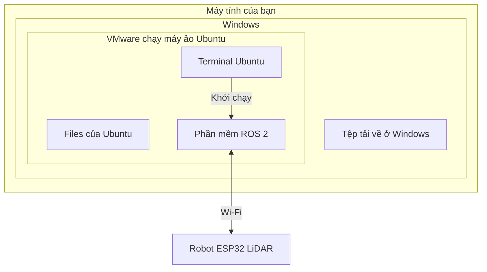

# Bài 1. Ubuntu là gì? Vì sao học robot cần dùng?

**Mục tiêu:** hiểu Ubuntu dùng để làm gì và biết đâu là nơi bạn sẽ chạy phần mềm robot.

**Chuẩn bị:** chưa cần cài phần mềm hoặc bật robot.

## 1. Ubuntu là một hệ điều hành

Hệ điều hành là phần mềm giúp bạn sử dụng máy tính: mở ứng dụng, quản lý tệp, kết nối Wi-Fi và làm việc với thiết bị.

Bạn có thể đã quen Windows. Ubuntu cũng có màn hình làm việc, thư mục, trình duyệt và phần cài đặt. Điểm khác dễ nhận ra là giao diện và cách cài, chạy một số phần mềm.

**Linux** là tên nền tảng mà Ubuntu sử dụng. Bạn chưa cần học cấu trúc Linux để bắt đầu các bài này.

| Thao tác quen thuộc trên Windows | Cách tương ứng trong Ubuntu |
| --- | --- |
| Mở File Explorer để tìm tệp | Mở **Files** |
| Mở Settings để chỉnh máy | Mở **Settings** |
| Dùng ổ `C:` và thư mục người dùng | Thường bắt đầu từ thư mục **Home** |
| Mở PowerShell hoặc Command Prompt để nhập lệnh | Mở **Terminal** |

Các công cụ có mục đích tương tự, nhưng không có nghĩa mọi lệnh Windows đều dùng được trong Ubuntu.

## 2. Ubuntu và ROS 2 có phải cùng một thứ không?

**Không. Ubuntu là hệ điều hành; ROS 2 là bộ công cụ chạy trên hệ điều hành.**

Trong bộ robot này, ROS 2 giúp các chương trình nhận dữ liệu cảm biến, hiển thị robot và gửi lệnh điều khiển cho nhau. Bạn sẽ dùng các chương trình đó sau khi học xong thao tác Ubuntu cơ bản.

| Tên xuất hiện trong tài liệu | Hiểu đơn giản |
| --- | --- |
| Ubuntu 22.04 | Môi trường làm việc trên máy tính |
| ROS 2 Humble | Bộ công cụ hỗ trợ phần mềm robot |
| RViz | Ứng dụng xem robot, dữ liệu cảm biến và bản đồ |
| Workspace | Thư mục chứa phần mềm của một dự án robot |

Bạn chưa cần cài từng thành phần ở bài này. Nếu dùng máy ảo ROBOVIS, môi trường robot đã được chuẩn bị sẵn.

## 3. Dùng Windows thì Ubuntu nằm ở đâu?

**Máy ảo** là một máy tính được mô phỏng bằng phần mềm. VMware mở máy ảo Ubuntu trong một cửa sổ trên Windows.

Windows và Ubuntu máy ảo có **thư mục, địa chỉ IP và ứng dụng riêng**. Tệp bạn tải bằng trình duyệt Windows không tự xuất hiện trong Home của Ubuntu. Hai bên chỉ trao đổi tệp khi có thao tác sao chép hoặc thiết lập chia sẻ phù hợp.

Nếu máy tính đã cài Ubuntu trực tiếp, bạn mở Terminal ngay trên Ubuntu, không cần VMware.

## 4. Phần mềm nào chạy trên máy tính, phần nào chạy trên robot?

Robot thu thập dữ liệu cảm biến và thực hiện lệnh động cơ. Máy tính nhận dữ liệu để hiển thị, tạo bản đồ hoặc tính đường đi.

Vì vậy, học Ubuntu ở đây là học cách sử dụng **máy tính làm việc cùng robot**. Bạn không cài Ubuntu vào ESP32. Trong series này cũng chưa cần sửa hoặc nạp chương trình cho ESP32.

## 5. Tự kiểm tra trước khi học tiếp

Hãy thử trả lời ba câu sau bằng lời của bạn:

1. Nếu đang dùng Windows và VMware, bạn nhập lệnh ROS 2 ở cửa sổ nào?
2. Tải một tệp trên Windows có làm tệp tự xuất hiện trong Ubuntu không?
3. ROS 2 và Ubuntu có phải là một phần mềm không?

??? success "Xem đáp án"
    1. Terminal bên trong Ubuntu máy ảo.
    2. Không. Cần chuyển tệp sang Ubuntu hoặc dùng thư mục chia sẻ đã thiết lập.
    3. Không. Ubuntu là hệ điều hành; ROS 2 là bộ công cụ chạy trên hệ điều hành.

**Bạn đã hoàn thành bài này khi:** xác định được nơi cần thao tác trên máy tính của mình.

[← Lộ trình học](index.md) · [Bài 2: Chuẩn bị môi trường →](02-chuan-bi-moi-truong.md)
