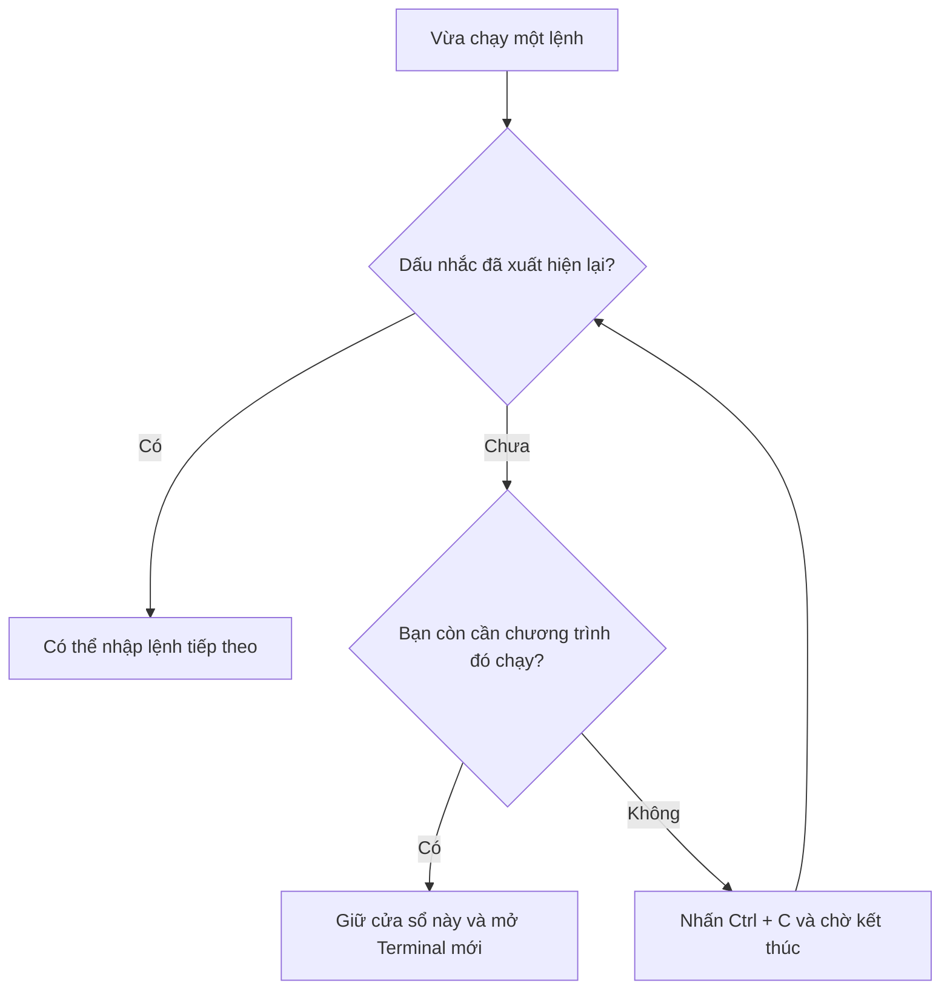

# Bài 4. Làm quen với Terminal

**Mục tiêu:** tự nhập một lệnh, nhận biết khi lệnh đã chạy xong và dừng được lệnh đang chạy.

**Chuẩn bị:** Ubuntu đã mở. Bài này không cần Internet và không cần robot.

## 1. Terminal dùng để làm gì?

Terminal là cửa sổ để bạn yêu cầu máy tính thực hiện công việc bằng cách nhập lệnh. Trong tài liệu robot, nhiều phần mềm được mở theo cách này.

Bạn chỉ cần học cách nhập, đọc kết quả và dừng lệnh trước. Chưa cần ghi nhớ nhiều tên lệnh.

## 2. Mở Terminal đúng nơi

Trong **Ubuntu**, nhấn **Ctrl + Alt + T**. Nếu phím tắt không hoạt động, mở **Activities**, gõ `Terminal`, rồi mở ứng dụng.

Bạn sẽ thấy dòng gần giống:

**Ví dụ màn hình, không phải lệnh cần chạy:**

```text
robovis@ubuntu:~$
```

| Phần hiển thị | Ý nghĩa |
| --- | --- |
| `robovis` | Tên tài khoản đang dùng |
| `ubuntu` | Tên máy tính |
| `~` | Đang ở thư mục Home |
| `$` | Terminal đang chờ bạn nhập lệnh với tài khoản thông thường |

Dòng này gọi là **dấu nhắc lệnh**. Tên người dùng trên máy bạn có thể khác. Không gõ lại `robovis@ubuntu:~$` khi sao chép lệnh từ tài liệu.

!!! note "Nếu màn hình bắt đầu bằng PS C:\\..."
    Bạn đang ở PowerShell của Windows. Hãy chuyển vào máy ảo Ubuntu và mở Terminal bên trong đó.

## 3. Chạy lệnh đầu tiên

Gõ lệnh sau, rồi nhấn **Enter**:

```bash
pwd
```

Lệnh `pwd` cho biết Terminal đang làm việc trong thư mục nào.

**Kết quả ví dụ:**

```text
/home/robovis
```

Ngay dưới kết quả, dấu nhắc xuất hiện trở lại. Nghĩa là lệnh đã kết thúc và bạn có thể nhập lệnh tiếp theo.

Tiếp tục chạy:

```bash
whoami
```

**Kết quả cần thấy:** tên tài khoản Ubuntu của bạn. Hai lệnh trên chỉ đọc thông tin, không sửa dữ liệu.

## 4. Sao chép và dán lệnh

Trong trình duyệt, sao chép lệnh bằng nút sao chép hoặc **Ctrl + C**. Chuyển vào Terminal và dùng **Ctrl + Shift + V** để dán. Đọc lại lệnh, rồi nhấn **Enter**.

| Việc cần làm | Phím trong Terminal Ubuntu |
| --- | --- |
| Sao chép phần đã bôi chọn | **Ctrl + Shift + C** |
| Dán | **Ctrl + Shift + V** |
| Gọi lại lệnh vừa chạy | **Mũi tên lên** |
| Xóa nội dung đang nhập trước con trỏ | **Ctrl + U** |
| Yêu cầu dừng chương trình đang chạy | **Ctrl + C** |

**Ctrl + C trong Terminal thường dùng để dừng chương trình**, không phải phím sao chép thông thường.

Nếu sao chép từ Windows vào Ubuntu máy ảo chưa hoạt động, gõ tay các lệnh ngắn trong bài. Clipboard giữa Windows và Ubuntu còn phụ thuộc cấu hình VMware; điều đó không có nghĩa lệnh sai.

## 5. Thử một lệnh chạy liên tục

Chạy:

```bash
ping 127.0.0.1
```

`127.0.0.1` là địa chỉ để máy tính liên lạc với **chính nó**. Bài tập này không kiểm tra robot hoặc Internet.

Bạn sẽ thấy những dòng phản hồi tiếp tục xuất hiện. Dấu nhắc chưa quay lại vì `ping` vẫn đang chạy.

Nhấn **Ctrl + C** trong cửa sổ đó.

**Kết quả cần thấy:** `ping` in thống kê rồi kết thúc; dấu nhắc xuất hiện trở lại. Các con số thời gian phản hồi có thể khác nhau giữa các máy.

Nếu hệ thống báo `ping: command not found`, dừng bài tập này và xem phần cài công cụ ở bài 6. Không cần đổi địa chỉ IP để sửa lỗi thiếu lệnh.

## 6. Khi nào cần mở Terminal thứ hai?

Sau này, một Terminal có thể đang chạy chương trình kết nối robot. Bạn phải giữ nó chạy, đồng thời mở Terminal khác để kiểm tra dữ liệu.



Để tập, mở một Terminal mới bằng **Ctrl + Alt + T**. Chạy `whoami` ở cửa sổ mới. Sau đó chuyển lại cửa sổ cũ: cả hai đều có thể sử dụng độc lập.

Một chương trình không in thêm dòng mới chưa chắc bị treo. Một số chương trình đang chờ dữ liệu. Hãy xem hướng dẫn của lệnh đó trước khi quyết định dừng.

## 7. Những lỗi nhập lệnh dễ gặp

| Hiện tượng | Kiểm tra trước tiên |
| --- | --- |
| `command not found` | Có gõ sai tên lệnh, sai chữ hoa/thường hoặc chưa cài công cụ không? |
| Xuất hiện dấu `>` ở đầu dòng mới | Có thể thiếu dấu nháy đóng. Nhấn **Ctrl + C**, nhập lại đúng lệnh |
| Dán cả kết quả vào Terminal | Chỉ sao chép phần **lệnh cần chạy** |
| Gõ mà không thấy dấu nhắc | Chương trình trước có thể vẫn đang chạy hoặc đang hỏi thông tin |

## Tự thực hành

Mở Terminal, chạy `pwd`, gọi lại lệnh bằng mũi tên lên, rồi chạy `ping 127.0.0.1` và dừng bằng **Ctrl + C**.

**Bạn đã hoàn thành bài này khi:** phân biệt được lệnh cần chạy, kết quả trả về và dấu nhắc đang chờ nhập.

[← Bài 3](03-giao-dien-ubuntu.md) · [Bài 5: Thư mục, đường dẫn và tệp →](05-thu-muc-va-tep.md)
