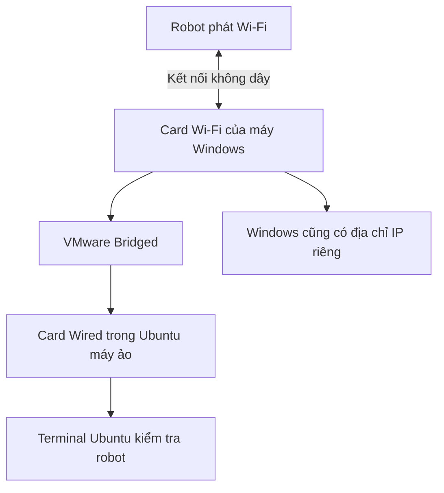

# Bài 7. Kết nối máy tính với robot

**Mục tiêu:** biết Ubuntu có liên lạc được với robot hay chưa, trước khi chạy phần mềm điều khiển.

**Chuẩn bị:** robot ESP32 LiDAR/SLAM, Ubuntu đã mở và đã biết dùng Terminal. Bài này chỉ kiểm tra kết nối, chưa gửi lệnh chuyển động.

## 1. Wi-Fi và địa chỉ IP khác nhau thế nào?

**Tên Wi-Fi** giúp bạn chọn mạng để tham gia. **Địa chỉ IP** giúp các thiết bị trong mạng tìm đến nhau.

Ví dụ của bộ robot hiện tại:

| Thông tin | Giá trị mặc định trong tài liệu ROBOVIS |
| --- | --- |
| Tên Wi-Fi robot | `ESP32_SLAM` hoặc `ESP SLAM`, tùy phiên bản |
| Mật khẩu Wi-Fi | `12345678` |
| Địa chỉ robot | `192.168.4.1` |
| Địa chỉ Ubuntu dùng với robot | `192.168.4.99` |

Đây là cấu hình của **bộ robot này**, không phải giá trị mặc định của mọi robot ESP32. Nếu thiết bị đã được cấu hình lại, dùng thông tin cấu hình hiện tại.

## 2. Hiểu đường kết nối trên máy Windows



**Bridged** là chế độ cho máy ảo tham gia mạng qua card mạng máy thật. Vì vậy, Windows kết nối được Wi-Fi chưa đảm bảo Ubuntu máy ảo đã có IP đúng.

Ubuntu cài trực tiếp thì kết nối Wi-Fi ngay trong Ubuntu, bỏ qua nhánh Windows và VMware.

## 3. Kết nối Wi-Fi robot

1. Bật nguồn robot theo hướng dẫn sản phẩm.
2. Nếu dùng máy ảo, mở danh sách Wi-Fi **trên Windows**. Nếu cài Ubuntu trực tiếp, mở Wi-Fi **trong Ubuntu**.
3. Chọn `ESP32_SLAM` hoặc `ESP SLAM` đúng với robot.
4. Nhập mật khẩu `12345678` nếu robot vẫn dùng cấu hình mặc định.
5. Giữ kết nối dù máy tính báo **No Internet**.

Wi-Fi robot dùng cho liên lạc nội bộ nên có thể không cung cấp Internet. Trong lúc này, không dùng việc mở được Google hay không làm tiêu chí kiểm tra robot.

## 4. Kiểm tra địa chỉ bên trong Ubuntu

Mở Terminal Ubuntu và chạy:

```bash
ip -br -4 addr
```

**Ví dụ kết quả:**

```text
lo               UNKNOWN        127.0.0.1/8
ens33            UP             192.168.4.99/24
```

Tên `ens33` có thể khác, ví dụ `ens160` hoặc `wlp2s0`. Hãy nhìn vào địa chỉ, không yêu cầu tên card giống hệt ví dụ.

- `127.0.0.1` là địa chỉ của chính máy Ubuntu, không phải kết nối đến robot.
- `192.168.4.99/24` là địa chỉ Ubuntu mong đợi trong cấu hình này.
- `/24` mô tả kích thước mạng; khi điền trong giao diện, thường tương ứng với netmask `255.255.255.0`.

Một địa chỉ khác trong cùng mạng **có thể vẫn ping được robot**, nhưng cấu hình robot gửi dữ liệu về máy tính có thể yêu cầu đúng `192.168.4.99`. Vì vậy, không dừng kiểm tra chỉ vì ping thành công.

### Nếu Ubuntu chưa có IP đúng

Với máy ảo ROBOVIS, trước tiên kiểm tra Windows còn kết nối đúng Wi-Fi, sau đó kiểm tra **VMware → Settings → Network Adapter → Bridged** và trạng thái kết nối của card ảo. Nếu máy có nhiều card mạng, chế độ Automatic có thể chọn sai card; cần chọn đúng card Wi-Fi đang kết nối robot trong thiết lập bridge.

Nếu vẫn chưa đúng, xem mục cấu hình thủ công bên dưới hoặc gửi ảnh cài đặt mạng để kiểm tra.

??? info "Đặt IP thủ công cho kết nối robot khi cần"
    Chỉ áp dụng khi robot vẫn dùng mạng mặc định `192.168.4.0/24` và chưa có thiết bị khác dùng `192.168.4.99`. Chụp lại cấu hình cũ trước khi thay đổi.

    Trong Ubuntu, mở **Settings → Network → Wired → biểu tượng bánh răng** nếu dùng máy ảo. Nếu Ubuntu nối Wi-Fi trực tiếp, mở phần cài đặt mạng Wi-Fi robot tương ứng.

    Chọn **IPv4 → Manual**. Điền **Address: `192.168.4.99`**, **Netmask: `255.255.255.0`**. Với kết nối nội bộ chỉ dùng trao đổi robot cùng mạng, có thể để trống Gateway và DNS nếu giao diện cho phép; đây không phải cấu hình Internet.

    Chọn **Apply**, ngắt rồi kết nối lại card mạng. Chạy lại `ip -br -4 addr`. Nếu đây là card Wired ảo đang đặt IP thủ công, khi đổi Windows về Wi-Fi có Internet bạn có thể cần chuyển IPv4 của card này về **Automatic (DHCP)**, rồi kết nối lại. Khi quay về robot, khôi phục cấu hình robot.

    Tham khảo thao tác giao diện tại [hướng dẫn đặt mạng thủ công của Ubuntu](https://help.ubuntu.com/stable/ubuntu-help/net-manual.html.en).

## 5. Kiểm tra robot bằng `ping`

Trong Terminal Ubuntu, chạy:

```bash
ping -c 4 192.168.4.1
```

`-c 4` nghĩa là gửi bốn lần rồi tự dừng. Bạn không cần nhấn Ctrl + C trong lần thử này.

**Kết quả ví dụ khi kết nối tốt:**

```text
64 bytes from 192.168.4.1: icmp_seq=1 ttl=255 time=3.2 ms
...
4 packets transmitted, 4 received, 0% packet loss
```

Thời gian và `ttl` có thể khác. Điều cần quan sát là có phản hồi từ đúng địa chỉ và tỷ lệ mất gói.

| Kết quả | Hiểu thế nào? | Bước tiếp theo |
| --- | --- | --- |
| Có phản hồi, `0% packet loss` | Phép thử mạng cơ bản thành công | Kiểm tra IP đích dữ liệu rồi sang bài khởi động robot |
| Có phản hồi nhưng mất một số gói | Kết nối có thể chập chờn | Đưa máy gần robot hơn và kiểm tra lại |
| `100% packet loss` | Chưa nhận phản hồi ping | Kiểm tra nguồn robot, Wi-Fi, IP và bridge |
| `Network is unreachable` | Ubuntu chưa có đường mạng phù hợp | Xem card mạng và IP trước |

**Ping thành công chưa xác nhận ROS 2 hoạt động.** Đây là bước kiểm tra kết nối mạng; phần mềm robot còn cần môi trường và chương trình giao tiếp chạy đúng.

## 6. Nếu robot dùng Wi-Fi ngoài

Khi robot và máy tính cùng nối mạng của nhà hoặc phòng lab, địa chỉ thường khác `192.168.4.x`. Không sao chép nguyên cặp IP mặc định ở trên.

Bạn cần biết IP hiện tại của robot và IP Ubuntu mà robot gửi dữ liệu tới. Nếu router tự cấp địa chỉ, IP máy tính có thể thay đổi sau lần kết nối khác. Khi đó cần đặt IP cố định/đặt chỗ DHCP phù hợp hoặc cấu hình lại địa chỉ máy tính trong robot theo bài Wi-Fi ngoài của sản phẩm.

Với máy ảo, địa chỉ cần kiểm tra là **IP Ubuntu**, không mặc nhiên là IP Windows.

## 7. Kiểm tra USB nếu bài hướng dẫn yêu cầu

Kết nối Wi-Fi ở trên không bắt buộc cắm USB. Phần này chỉ dùng khi cần kiểm tra một thiết bị USB theo hướng dẫn sản phẩm.

Chạy trước và sau khi cắm thiết bị:

```bash
lsusb
```

Quan sát dòng mới xuất hiện. Nếu dùng VMware, có thể cần chọn **VM → Removable Devices → thiết bị → Connect (Disconnect from host)** để chuyển thiết bị từ Windows sang Ubuntu.

Việc thấy thiết bị trong `lsusb` chưa đảm bảo chương trình đã có quyền mở cổng serial. Khi có lỗi quyền, ghi lại chính xác thông báo và tên cổng để xử lý theo tài liệu sản phẩm. Bài này không yêu cầu nạp firmware.

**Bạn đã hoàn thành bài này khi:** xác định đúng Wi-Fi, tìm được IP Ubuntu và đọc được kết quả ping robot.

[← Bài 6](06-cai-va-chay-phan-mem.md) · [Bài 8: Thực hành và xử lý lỗi →](08-thuc-hanh-va-loi.md)
