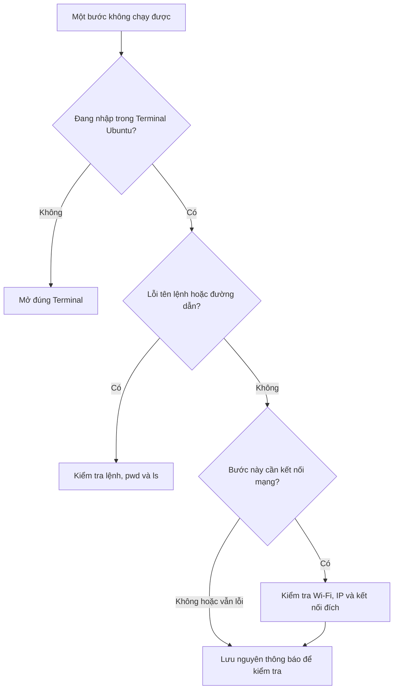

# Bài 8. Thực hành tổng hợp và xử lý lỗi

**Mục tiêu:** tự thực hiện một công việc nhỏ từ đầu đến cuối, sau đó biết cách cung cấp thông tin khi gặp lỗi.

**Chuẩn bị:** đã học bài 3–6. Phần kiểm tra robot là tùy chọn nếu chưa có robot bên cạnh.

## 1. Nhiệm vụ thực hành

Bạn sẽ tạo một thư mục, lưu ghi chú và ghi nhận cấu hình Ubuntu. Toàn bộ thao tác thực hiện trong **Ubuntu**.

### Bước 1. Tạo thư mục bài tổng hợp

```bash
mkdir -p ~/hoc_ubuntu/tong_hop
```

```bash
cd ~/hoc_ubuntu/tong_hop
```

```bash
pwd
```

**Kết quả cần thấy:** đường dẫn kết thúc bằng `/hoc_ubuntu/tong_hop`.

### Bước 2. Ghi nhận phiên bản Ubuntu

```bash
cat /etc/os-release
```

Tìm dòng `PRETTY_NAME` hoặc `VERSION_ID`. Môi trường theo bộ tài liệu này cần là Ubuntu **22.04**. Lệnh trên chỉ đọc thông tin hệ điều hành.

Tiếp tục:

```bash
whoami
```

Ghi nhớ tên tài khoản mà lệnh trả về.

### Bước 3. Tạo tệp kết quả

```bash
nano ket_qua.txt
```

Nhập mẫu sau và thay nội dung theo máy của bạn:

```text
Ten tai khoan: ghi ten vua thay
Phien ban Ubuntu: ghi phien ban vua thay
Dang dung: may ao VMware hoac Ubuntu truc tiep
Thu muc thuc hanh: ghi ket qua lenh pwd
Toi da biet dung Ctrl+C de dung lenh ping.
```

Lưu bằng **Ctrl + O**, **Enter**, rồi thoát bằng **Ctrl + X**. Kiểm tra:

```bash
cat ket_qua.txt
```

**Kết quả cần thấy:** các thông tin bạn vừa ghi, không còn nguyên phần yêu cầu “ghi tên vừa thấy”.

### Bước 4. Tìm lại tệp bằng giao diện

Mở **Files → Home → hoc_ubuntu → tong_hop**. Bạn cần thấy `ket_qua.txt`.

Đây là tệp thật trên Ubuntu. Khi khởi động lại máy ảo bình thường, tệp vẫn còn, trừ khi bạn chủ động xóa hoặc khôi phục máy ảo về trạng thái cũ.

### Bước 5. Đọc tệp từ vị trí khác

Trong Terminal, chạy:

```bash
cd ~
```

```bash
cat ~/hoc_ubuntu/tong_hop/ket_qua.txt
```

Nếu đọc được đúng nội dung, bạn đã hiểu cách dùng đường dẫn mà không phụ thuộc thư mục hiện tại.

## 2. Kiểm tra thêm nếu đã có môi trường robot

Chạy:

```bash
printenv ROS_DISTRO
```

Nếu chưa hiện `humble`, quay lại phần môi trường ở [bài 6](06-cai-va-chay-phan-mem.md). Tiếp theo:

```bash
ros2 --help
```

Bạn cần thấy phần trợ giúp. Nếu robot đã bật và kết nối đúng mạng:

```bash
ip -br -4 addr
```

```bash
ping -c 4 192.168.4.1
```

Địa chỉ trên chỉ dùng khi robot vẫn sử dụng cấu hình mặc định. Kết quả IP và ping được đọc theo [bài 7](07-ket-noi-robot.md).

Hoàn thành bước này mới cho thấy môi trường cơ bản đã sẵn sàng. Chưa có chương trình bringup chạy thì không nên dùng việc thiếu topic robot để kết luận phần cứng bị lỗi.

## 3. Gặp lỗi thì kiểm tra theo thứ tự nào?



Không cần cài lại Ubuntu khi mới gặp một lỗi. Trước tiên, xác định lỗi thuộc thao tác, tệp, phần mềm hay mạng.

## 4. Bảng tra lỗi nhanh

| Bạn thấy gì? | Có thể do đâu? | Làm gì tiếp? |
| --- | --- | --- |
| `command not found` | Gõ sai hoặc công cụ chưa được cài/nạp môi trường | Kiểm tra tên lệnh; xem bài 6 |
| `No such file or directory` | Sai vị trí hoặc tệp chưa có | Dùng `pwd`, `ls`; xem bài 5 |
| `Permission denied` | Không đủ quyền với tệp hoặc thiết bị | Ghi lại tệp/cổng bị lỗi; không tự thêm `sudo` vào lệnh ROS 2 |
| Nhập mật khẩu mà không thấy ký tự | Terminal đang ẩn mật khẩu | Gõ đủ mật khẩu rồi Enter |
| Terminal chưa trả dấu nhắc | Chương trình còn chạy hoặc chờ nhập | Đọc dòng cuối; giữ mở hoặc Ctrl + C tùy mục đích |
| Dấu `>` xuất hiện sau lệnh vừa gõ | Có thể thiếu dấu nháy hoặc cấu trúc lệnh chưa đóng | Ctrl + C rồi nhập lại lệnh đầy đủ |
| Robot Wi-Fi báo No Internet | Mạng robot chỉ dùng nội bộ | Giữ kết nối, thử ping robot |
| Windows có Internet, Ubuntu không có | Cấu hình card ảo/IP khác Windows | Xem lại Bridged và IPv4 trong Ubuntu |
| Tải tệp xong nhưng không tìm thấy | Tải ở hệ điều hành khác hoặc thư mục khác | Xác định trình duyệt Windows hay Ubuntu |
| `Package ... not found` trong ROS 2 | Chưa nạp workspace hoặc chưa có gói | Kiểm tra đúng môi trường và workspace của sản phẩm |

## 5. Gửi thông tin lỗi thế nào để dễ hỗ trợ?

Một ảnh chỉ có dòng “Error” thường thiếu nguyên nhân. Hãy gửi cả lệnh đã chạy và đoạn thông báo liên quan trước/sau lỗi.

Bạn có thể dùng mẫu sau:

```text
Tôi đang làm bài: ...
Bước bị lỗi: ...
Tôi dùng Ubuntu trực tiếp / VMware: ...
Phiên bản Ubuntu: ...
Lệnh đã chạy: ...
Kết quả tôi mong đợi: ...
Thông báo thực tế: ...
Nếu lỗi mạng: Wi-Fi đang kết nối, IP Ubuntu, kết quả ping.
```

Trong Terminal, bôi chọn nội dung rồi **Ctrl + Shift + C** để sao chép. Hoặc chụp cửa sổ có cả câu lệnh và thông báo. Không cần gửi mật khẩu Wi-Fi cá nhân hay mật khẩu tài khoản.

## 6. Bạn đã sẵn sàng học phần robot chưa?

| Việc cần làm | Tự kiểm tra |
| --- | --- |
| Mở đúng Terminal Ubuntu | Tôi không nhập nhầm vào PowerShell |
| Sao chép và chạy lệnh | Tôi chỉ chạy phần lệnh, không chạy phần kết quả |
| Đọc đường dẫn | Tôi tìm được tệp trong Home |
| Giữ một chương trình chạy | Tôi biết mở Terminal thứ hai |
| Dừng chương trình | Tôi biết Ctrl + C và chờ dấu nhắc trở lại |
| Kiểm tra môi trường | Tôi phân biệt được cài phần mềm với `source` |
| Kiểm tra mạng robot | Tôi biết tìm IP Ubuntu và đọc kết quả ping |

Nếu đã làm được các việc trên, chuyển sang khu vực [ESP32 LiDAR](../robot-esp32-lidar/index.md) trên website. Làm bài [Khởi động và kiểm tra dữ liệu](../robot-esp32-lidar/03-van-hanh/02-khoi-dong-va-kiem-tra.md) trước, sau đó mới [Chạy thử lần đầu](../robot-esp32-lidar/03-van-hanh/01-chay-thu-lan-dau.md).

Nếu Ubuntu của bạn chưa có ROS 2 và workspace, hoàn thành các bài [Cài ROS 2](../robot-esp32-lidar/02-chuan-bi/01-yeu-cau-va-cai-ros2.md) và [Cài workspace](../robot-esp32-lidar/02-chuan-bi/02-cai-dat-workspace.md) của sản phẩm trước bước khởi động.

## Tài liệu đọc thêm

Sau khi hoàn thành bài thực hành, bạn có thể học thêm các thao tác Terminal qua [hướng dẫn dòng lệnh cho người mới của Ubuntu](https://ubuntu.com/tutorials/command-line-for-beginners).

[← Bài 7](07-ket-noi-robot.md) · [Quay lại lộ trình Ubuntu cơ bản](index.md)
