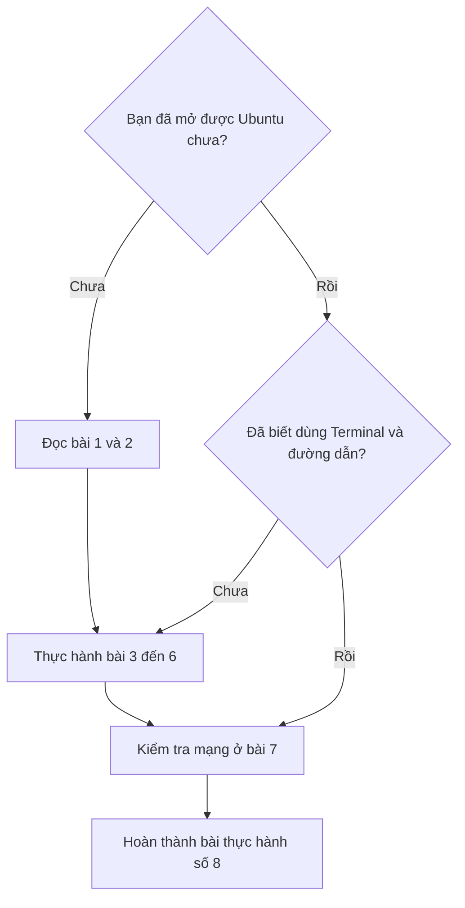

# Ubuntu cơ bản cho người mới học robot

Bạn chưa từng dùng Ubuntu? Hãy bắt đầu từ đây. Bạn sẽ tập mở ứng dụng, chạy lệnh, tìm tệp và kiểm tra mạng trước khi chuyển sang tài liệu robot.

**Không cần biết lập trình để học series này.** Các bài thực hành đầu tiên chỉ thao tác trên máy tính; chưa cần bật robot.

## Bạn sẽ học những gì?

| Bài | Nội dung | Kết quả sau bài học |
| --- | --- | --- |
| [1. Ubuntu là gì?](01-ubuntu-la-gi.md) | Phân biệt Ubuntu, máy ảo và ROS 2 | Biết phần mềm chạy ở đâu |
| [2. Chuẩn bị môi trường](02-chuan-bi-moi-truong.md) | Mở máy ảo ROBOVIS hoặc kiểm tra Ubuntu đã có | Vào được màn hình Ubuntu |
| [3. Làm quen với giao diện](03-giao-dien-ubuntu.md) | Mở ứng dụng, tìm tệp, chỉnh màn hình, tắt máy | Tự thao tác bằng chuột |
| [4. Làm quen với Terminal](04-terminal.md) | Nhập lệnh, dán lệnh, đọc kết quả và dừng lệnh | Tự chạy được một hướng dẫn bằng lệnh |
| [5. Thư mục, đường dẫn và tệp](05-thu-muc-va-tep.md) | Tìm đúng thư mục, tạo và sửa tệp thực hành | Hiểu lệnh đang làm việc ở đâu |
| [6. Cài phần mềm và chạy chương trình](06-cai-va-chay-phan-mem.md) | `sudo`, `apt`, chương trình Python và môi trường ROS 2 | Phân biệt cài đặt, chuẩn bị môi trường và chạy |
| [7. Kết nối máy tính với robot](07-ket-noi-robot.md) | Wi-Fi, IP, máy ảo Bridged và kiểm tra USB | Kiểm tra được kết nối cơ bản |
| [8. Thực hành và xử lý lỗi](08-thuc-hanh-va-loi.md) | Tự tạo hồ sơ thực hành, kiểm tra máy và gửi thông tin lỗi | Sẵn sàng chuyển sang tài liệu vận hành robot |

## Nên bắt đầu ở đâu?

## Môi trường dùng trong ví dụ

Các thao tác được viết theo **Ubuntu Desktop 22.04**. Phần liên hệ với Robot ESP32 LiDAR/SLAM dùng **ROS 2 Humble**, phù hợp với bộ tài liệu ROBOVIS hiện tại.

Nếu dùng Windows, bạn thực hành trong **máy ảo Ubuntu của ROBOVIS chạy bằng VMware**. Lệnh trong series được nhập ở Terminal Ubuntu. Những thao tác thực hiện bên Windows sẽ được ghi rõ.

!!! tip "Cách học dễ nhất"
    Đọc một bước, thực hiện ngay bước đó, rồi so sánh với phần **Kết quả cần thấy**. Chưa cần nhớ hết các lệnh. Bạn có thể quay lại bài để tra khi cần.

## Quy ước trong các bài

- **Lệnh cần chạy** nằm trong khung có nhãn Bash hoặc Python và có nút sao chép.
- **Kết quả ví dụ** là phần máy tính trả về. Không sao chép phần này để chạy.
- Tên người dùng, tên card mạng và đường dẫn trên máy bạn có thể khác ví dụ.
- Mỗi khung lệnh ngắn tương ứng một thao tác. Chạy xong rồi mới chuyển bước tiếp theo.

[Bắt đầu bài 1: Ubuntu là gì? →](01-ubuntu-la-gi.md)

## Tải tài liệu

[Tải bộ tài liệu Ubuntu cơ bản dạng ZIP](../tai-xuong/ubuntu-co-ban.md).
